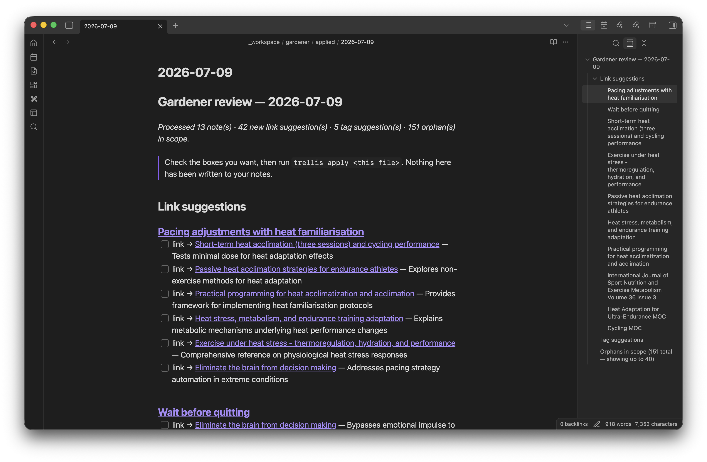
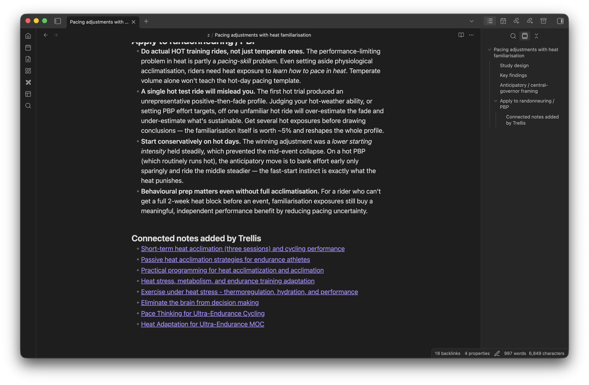

# 🌿 Trellis

A local-LLM gardener for an Obsidian vault. Structure for your notes to grow on.

Everything runs locally against [Ollama](https://ollama.com). No note ever leaves
the machine. Trellis never edits your notes directly — it writes dated review
files of suggestions, and only what you check off gets applied.



## Features

- **Index + search** — an incremental embedding index over the vault, plus
  semantic search and per-note neighbor lookup.
- **Nightly gardener** — link suggestions (embeddings for recall → small model
  for precision), tag suggestions for thin notes (controlled vocabulary), and
  orphan detection. Emits a dated, checkbox review queue to
  `_workspace/gardener/` — never edits notes directly.
- **Apply step** — read back the checked boxes in a review file and apply
  approved tags/links to notes (links append to the body; tags fold into
  frontmatter via the vault's idempotent `migrate_tags`).
- **Auto-MOC detection** — cluster `z/` (UMAP → HDBSCAN), test each cluster
  against existing MOCs (centroid vs. MOC embeddings, plus how much is already
  MOC-linked), name the uncovered ones with the local gen model, and emit a
  dated candidate report to `_workspace/clusters/` with a ready-to-run
  `/moc` line each.

## Requirements

- Python 3.11+ with `numpy` (`pip install numpy`). The core commands (`index`,
  `search`, `garden`) are otherwise standard library only.
- Ollama running with an embedding model pulled:

  ```sh
  ollama pull qwen3-embedding:0.6b
  ```

- **Clustering (`cluster`) only** needs extra libraries in a venv:

  ```sh
  python3 -m venv .venv
  .venv/bin/python3 -m pip install -r requirements.txt   # numpy, scikit-learn, umap-learn, hdbscan
  ```

  `umap`/`hdbscan` are imported lazily, so the other commands keep working on
  bare system-python + numpy. Run any command via `.venv/bin/python3` once the
  venv exists.

## Configuration

Copy the example config and point it at your vault:

```sh
cp trellis.toml.example trellis.toml
```

`trellis.toml` is gitignored, so your paths stay local. CLI flags override the
file, and you can set the vault out-of-band with `TRELLIS_VAULT=/path/to/vault`.

### How my vault is laid out

I built trellis against my own vault, and a few of the defaults assume its
shape. The only parts that matter to trellis are two folders:

- `z/` — the Zettelkasten: ~1,100 atomic knowledge notes, each tagged in YAML
  frontmatter. This is the evergreen stuff worth linking and tagging, so it's
  what the gardener and the clusterer point at by default.
- `MOCs/` — Maps of Content: curated landing pages, one per topic cluster.
  Auto-MOC detection checks new clusters against these so it won't suggest a map
  I've already drawn.

Everything else — daily notes, people, project areas, admin files, the
`_workspace` scratch folder — trellis ignores. Not because it's unimportant, but
because a daily note doesn't need to be woven into the graph the way a permanent
note does.

The `z/` folder is my personal preference for storing Zettelkasten-style notes; most vaults don't have one. If yours is
laid out differently, you adapt trellis by changing a handful of variables, and you might be well-served by pointing your LLM agent of choice to this repo, and asking it to customize the code for you based on your setup and personal preferences.

### What to change for your setup

| Variable | What it does | Change it if… |
|---|---|---|
| `vault` | absolute path to your vault | always (or set `TRELLIS_VAULT`) |
| `garden_scope` | folder prefixes the gardener tends | your knowledge notes live somewhere other than `z/` |
| `cluster_scope` | folders auto-MOC detection clusters | same — point it at your evergreen notes |
| `exclude_dirs` | folders never indexed, matched by name at any depth | you keep other non-knowledge folders (attachments, archives, journals) |
| `embed_model` | the Ollama embedding model | you want more recall (`:4b`) or a smaller footprint (`embeddinggemma`) |
| `gen_model` | the model that judges link/tag suggestions | you prefer a different local model |
| `tag_thin_threshold` | only suggest tags for notes with ≤ this many | you tag more (or less) aggressively than I do |

The two scope variables are what actually adapt trellis to a different vault.
Both take a list of path prefixes, so you can aim them at several folders at once
(`garden_scope = ["notes/", "permanent/"]`) if your knowledge notes aren't in
one place. `exclude_dirs` matches on folder name anywhere in the tree, so adding
`"Journal"` skips every `Journal/` folder no matter how deep it sits.

## Usage

```sh
python3 trellis.py index               # incremental (re)index — only embeds changed notes
python3 trellis.py index --rebuild     # force a full re-embed
python3 trellis.py search "spaced repetition for habits"
python3 trellis.py neighbors "Dichotomy of Control"   # related-note preview
python3 trellis.py status
```

### Gardener

```sh
python3 trellis.py garden                  # tend up to `garden_limit` notes -> dated review queue
python3 trellis.py garden --dry-run        # print the report, write nothing
python3 trellis.py garden --limit 0        # no cap — drains the whole backlog (~3h for 877 notes)
python3 trellis.py garden --scope z/,MOCs  # restrict to path prefixes
python3 trellis.py garden --force          # re-garden notes even if unchanged
python3 trellis.py garden --note "VO2max"  # garden one note (title or path); implies --force
```

Reports land in `<vault>/_workspace/gardener/YYYY-MM-DD.md` as checkbox lists —
see [`examples/gardener-review-example.md`](examples/gardener-review-example.md)
for what one looks like.
Two ledgers in the DB make repeat runs cheap and quiet: `garden_state` skips
notes unchanged since they were last gardened, and `suggestions` prevents
re-surfacing an idea you've already seen. Notes are processed
most-disconnected-first, so orphans get attention before well-linked notes.
**Nothing is ever written to your notes** — the `apply` step (below) reads back
the checked boxes.

### Nightly scheduler (launchd)

`run-garden.sh` refreshes the index then gardens (it locates itself, so no
paths to edit); `com.trellis.garden.plist.example` runs it nightly at 03:00.
Copy the example, replace `/path/to/trellis` with your checkout's absolute path
(launchd doesn't expand `~`), then load it:

```sh
sed "s|/path/to/trellis|$PWD|g" com.trellis.garden.plist.example \
  > ~/Library/LaunchAgents/com.trellis.garden.plist
launchctl bootstrap gui/$(id -u) ~/Library/LaunchAgents/com.trellis.garden.plist
launchctl kickstart -k gui/$(id -u)/com.trellis.garden   # optional: run once now
```

Requires the Ollama app to be running (it autostarts at login). Output is logged
to `garden.log`. To stop: `launchctl bootout gui/$(id -u)/com.trellis.garden`.

### Applying a review

After checking the boxes you want in a review file (and editing tag lists / links
freely — the apply step reads the file as edited, not the original suggestions):

```sh
python3 trellis.py apply 2026-06-15.md            # bare filename resolves in _workspace/gardener/
python3 trellis.py apply 2026-06-15.md --dry-run  # preview; writes nothing
python3 trellis.py apply                          # no file → apply every pending review in _workspace/gardener/
python3 trellis.py apply --dry-run                # preview all pending reviews
```

With no file argument, `apply` processes every top-level `.md` in the gardener
folder (the `applied/` archive is skipped), applying and retiring each in turn and
printing a combined total at the end.



Links are folded into a single `### Connected notes added by Trellis` section at
the end of each source note (one section per note — repeat runs merge into it
rather than stacking dated blocks, and legacy `Added by Claude on <date>:` blocks
are absorbed into it). Tags are folded into YAML frontmatter via the vault's
`migrate_tags.migrate_content`. Already-present links/tags are skipped (safe to
re-run), and applied items are marked `status='applied'` in the ledger. Tag
application is skipped with a warning if `migrate_tags.py` can't be loaded (links
still apply).

These appended sections are stripped before embedding and before the gardener's
change-detection, so the links trellis adds never drift a note's vector or
re-trigger gardening on an otherwise-unchanged note.

Any non-dry-run `apply` moves the review file to a sibling `applied/` folder —
even if nothing was checked — so running `apply` on a file always retires it and
`gardener/` only shows reviews still pending. History is preserved (nothing is
deleted), and the archived file is the only human-readable record of suggestions
you *declined* (the seen-ledger keeps those from re-appearing). Use `--dry-run`
to apply nothing and leave the file in place.

### Auto-MOC detection

Finds dense thematic clusters in `z/` that no MOC covers yet, and writes them as
candidates you can build with the `/moc` skill. Requires the venv (see
Requirements above).

```sh
.venv/bin/python3 trellis.py cluster              # detect candidates -> review report
.venv/bin/python3 trellis.py cluster --dry-run    # print the report, write nothing
.venv/bin/python3 trellis.py cluster --limit 10   # cap candidates named/reported this run
.venv/bin/python3 trellis.py cluster --scope z/,Areas  # restrict to path prefixes
.venv/bin/python3 trellis.py cluster --force      # ignore the seen-ledger
```

Reports land in `<vault>/_workspace/clusters/YYYY-MM-DD.md`. Each candidate
shows its LLM-named theme, a suggested tag, the nearest existing MOC (with
similarity) and how much of the cluster is already MOC-linked, representative and
full member lists, and a ready-to-run `/moc <theme>` line. The `moc_candidates`
ledger keeps repeat runs quiet — and once you actually build a MOC for a theme,
the coverage test drops that cluster automatically on the next run. A cluster
counts as covered if it's semantically close to an MOC (`cover_sim_threshold`)
**or** most of its notes are already linked from one (`moc_link_cover_threshold`).
`cluster` is manual (not part of the nightly job); themes don't shift fast enough
to warrant nightly runs. The dials worth tuning are `cover_sim_threshold`,
`moc_link_cover_threshold`, and `hdbscan_min_cluster_size`.

Optional convenience alias:

```sh
alias trellis='~/Developer/trellis/.venv/bin/python3 ~/Developer/trellis/trellis.py'
```

## How it works

Each changed note is embedded as `title + tags + body` (frontmatter stripped).
Vectors are stored as float32 blobs in SQLite (`index.db`); search loads them into
a numpy matrix and ranks by cosine similarity. Change detection is by **content
hash**, not mtime — deliberately, because iCloud sync makes mtimes unreliable.
Switching `embed_model` triggers an automatic full rebuild (vectors from different
models aren't comparable).

Configuration lives in `trellis.toml`; CLI flags override it.

## Model notes

- **Embeddings:** `qwen3-embedding:0.6b` — 32K context (no truncation on long
  notes/MOCs), strong MTEB for its size. Bump to `:4b` if recall disappoints and
  you have the memory headroom. `embeddinggemma` is the smaller-footprint
  alternative (2K context).
- **Generation/judgment:** `qwen3.6:35b-a3b` (fast MoE) or `gemma4` — pull
  whichever you prefer with `ollama pull`. You should have good results with lower-parameter qwen3.6 models if the 35b version is too beefy for your machine (It runs fine on my M5 Pro Macbook Pro w/ 48 GB memory).

## Tests

```sh
python3 tests/test_trellis.py
```
